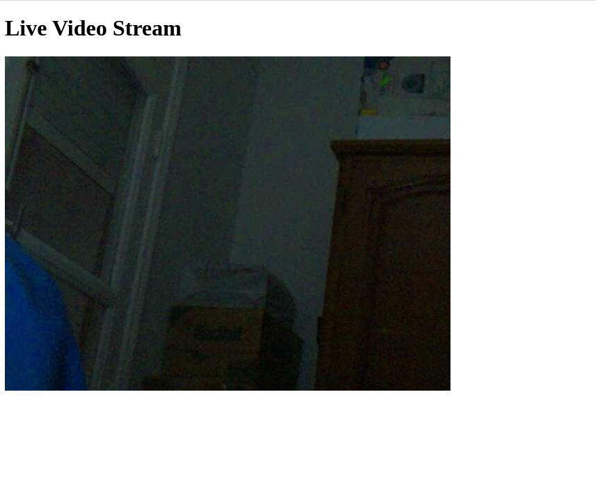
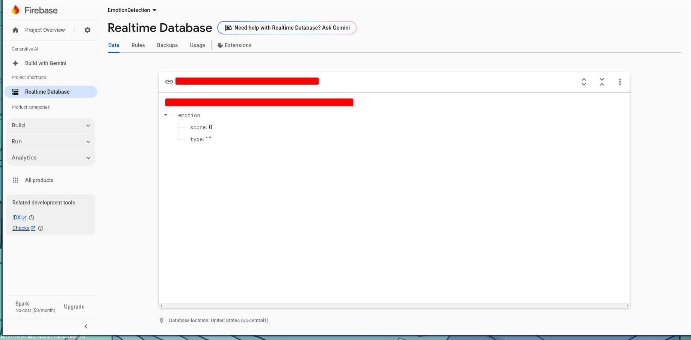

# emotionDetection_server
A real-time server that streams video using Flask while incorporating face detection and emotion detection.<br>

It features 2 programs:
- `serverOpenCV`: video streaming server that uses openCV and uses the WebCam on my laptop
- `serverPycam`: video streaming server that works on the rpi and relies on the `picam2` module.


## requiements:
- on the rpi create a  virtual environment 
```bash
python3 -m venv env --system-site-packages
```
This will let the virtual environment uses external packages that are installed on the system.<br>
I wasn't able to install the picam2 module in a venv, hence it was already installed in the raspbian OS.<br>
```bash
pip3 install opencv-python
pip3 install FER 
pip3 install flask 
pip3 install tensorflow==2.18.0
pip3 install numpy==1.26.4
pip3 install firebase_admin
```

## Firebase setup
- create a firebase account 
- create a new project 
- create a Real time database 
- download from firebase, the private API key in JSON format (found in project settings)
In your project directory should look like this 

You Should create the file structure:
```
secrest_dir
|
|-----API_Key.json 
|-----secrest_pack.py 
|-----__init__.py
```

- the `secrest_pack.py` contains the dataBase URL
```python3
databaseURL="URL"
```
- make sure to update the json path in the main code 
```python3 
init_firebase_connection("secrets_dir/path_to_json_file")
```
## Refrences:
[firebase](https://www.freecodecamp.org/news/how-to-get-started-with-firebase-using-python/)

[picam2](https://github.com/hadilaff/surveillance-and-security-system/blob/main/raspberryCode/live1.py)
